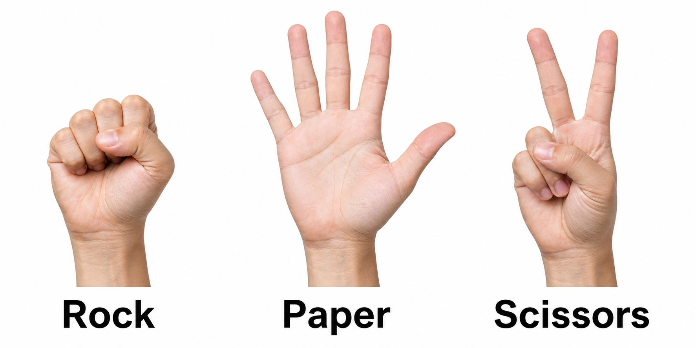

# About rock_paper_scissors_ai.py

You're about to make a Raspberry Pi play Rock Paper Scissors with you using a webcam.

That is pretty cool.

If the code looks like a lot at first, don't worry. You are not supposed to understand every line immediately. Most programmers don't read a whole program from top to bottom and magically understand it. They look for small pieces they recognize, run the program, change one thing, and see what happens.

That is exactly what you are going to do here.

This file is not something you have to be afraid of. It is something you can poke at, test, break a little, fix, and make your own.

## What The Program Does

When you run:

```bash
python3 rock_paper_scissors_ai.py
```

the program opens your webcam and watches for your hand.

Then it tries to figure out whether you are showing:

- Rock
- Paper
- Scissors

The computer picks one too, and the program decides who won the round.

## The Big Picture

Here is the basic idea:

```text
The camera sees your hand.
MediaPipe finds points on your hand.
Python counts how many fingers look raised.
The program guesses Rock, Paper, or Scissors.
The computer randomly picks its move.
The game decides who won.
```

That is the whole game. The code just breaks those steps into smaller instructions.

## What The Gestures Should Look Like

Try to make your hand easy for the camera to see.



Use clear gestures:

- Rock: a closed fist
- Paper: an open hand with fingers spread
- Scissors: two raised fingers in a V shape

Try to face your palm or fist toward the camera. Keep your whole hand in the picture.

## If The Code Looks Confusing

If the code looks confusing, that does not mean you are bad at coding. It means you are looking at something new.

New things usually look messy at first.

A good trick is to ignore most of the file for a moment and look for the section called:

```python
# STUDENT SETTINGS
```

That section was made for you. It has values you can safely change without needing to understand the whole program.

For example:

```python
CAMERA_NUMBER = 0
FRAME_WIDTH = 640
FRAME_HEIGHT = 480
WINNING_SCORE = 5
COUNTDOWN_SECONDS = 3
AI_NAMES = ["Computer", "Robo Ref", "Pi Champion"]
```

These settings control simple parts of the game.

## Things You Can Safely Change

Try changing one thing at a time.

To make the game shorter:

```python
WINNING_SCORE = 3
```

To give yourself more time before the program checks your hand:

```python
COUNTDOWN_SECONDS = 5
```

To rename the computer players:

```python
AI_NAMES = ["Code Champ", "Python Player", "The Machine"]
```

After you change something, run the program again and see what happens.

That is programming.

## The Tools Helping Us

This program uses a few Python libraries. A library is code someone else wrote so we can use it in our own project.

That means we do not have to teach Python how to open a webcam from scratch. Someone already built that tool, and we get to use it.

## OpenCV

OpenCV handles the webcam.

It gets the camera picture, shows it in a window, and lets us draw words on top of the video.

In this project, OpenCV is the part that lets you actually see the game happening.

A real-world way to think about OpenCV:

OpenCV is like the camera crew. It gets the video, puts it on the screen, and helps display messages during the game.

## MediaPipe

MediaPipe looks for your hand.

It finds points on your fingers and knuckles, kind of like putting invisible dots on your hand. The program uses those dots to decide how many fingers look raised.

A real-world way to think about MediaPipe:

Imagine a sports replay system that marks where a player's elbows, knees, and feet are. MediaPipe does something similar, but for your hand.

## random

The `random` library lets the computer pick Rock, Paper, or Scissors without always choosing the same thing.

A real-world way to think about `random`:

It is like putting Rock, Paper, and Scissors into a hat and having the computer pull one out without looking.

## time

The `time` library helps with the countdown before the game checks your hand.

A real-world way to think about `time`:

It is the referee counting down before both players show their move.

## How The Program Recognizes Your Hand

The program uses a simple rule:

- 0 or 1 raised fingers means Rock.
- 2 raised fingers means Scissors.
- 4 or 5 raised fingers means Paper.
- Anything else means Unknown.

That rule is not perfect, but it is easy to understand and easy to change.

This is important: the program is not thinking exactly like a person. It is following a rule based on what it sees.

## If The Game Says Unknown

Sometimes the game will say `Unknown`.

That does not mean you did anything wrong. It just means the camera did not get a clear enough look at your hand.

Try this:

- Hold your hand still when the countdown ends.
- Face your palm toward the camera.
- Keep your whole hand in the picture.
- Use brighter lighting.
- Move your hand away from your shirt or face.
- Use only one hand.
- Make the gesture bigger and clearer.
- Try a plain background.

For Rock, make a clear fist.

For Paper, open your hand wide.

For Scissors, hold up two clear fingers and fold the others down.

Scissors can be the trickiest one. If the game keeps missing it, try folding your other fingers down more clearly and spreading your two raised fingers apart.

## Why The Game Might Guess Wrong

The webcam only sees a flat picture. It does not understand your hand the same way your eyes do.

For example:

- If your hand is sideways, fingers may overlap.
- If the room is dark, the hand points may be harder to find.
- If your fingers are bent, the program may count them wrong.
- If your hand is partly off-screen, MediaPipe may miss some points.

This is normal in computer vision projects.

Computer vision means teaching computers to understand pictures and video. It can be powerful, but it is not perfect.

## How The Winner Is Chosen

After the program guesses your hand sign, the computer randomly picks its own sign.

Then the game uses the normal Rock Paper Scissors rules:

- Rock beats Scissors.
- Paper beats Rock.
- Scissors beats Paper.
- If both players choose the same thing, it is a tie.

If your hand sign is `Unknown`, the program asks you to show Rock, Paper, or Scissors again.

## What Happens When You Press Keys

The game listens for a few keyboard controls:

- Press `space` to start a round.
- Press `r` to reset the score.
- Press `q` to quit.

OpenCV helps the program notice those key presses.

## Things To Try

Try these small experiments:

- Change the winning score.
- Make the countdown longer.
- Add your name to `AI_NAMES`.
- Change one of the messages on the screen.
- Change the color of the score text.
- Add a message when the game says `Unknown`.
- Add sound effects for winning or losing.
- Keep track of how many ties happen.

You do not have to do all of these. Pick one that sounds fun.

## If Something Breaks

Something breaking does not mean you failed.

It usually means the computer got an instruction it did not understand.

Try this:

1. Read the error message.
2. Look at the last thing you changed.
3. Change it back or fix one small thing.
4. Run the program again.

That is how debugging works.

Debugging is not a punishment. It is part of programming.

## You Are Already Doing Real Programming

If you run the program, change a setting, and test what happens, you are programming.

If you get an error and try to fix it, you are programming.

If you ask, "What happens if I change this?" and then test it, you are programming.

You do not need to understand everything at once. Start small, stay curious, and have fun with it.
